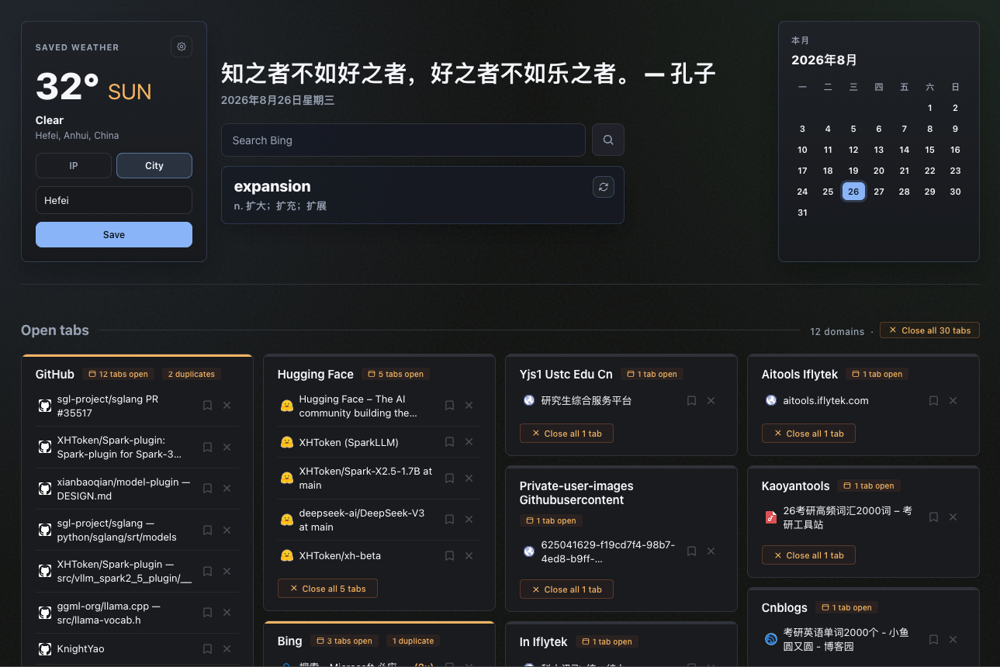

# ChromeTab

ChromeTab replaces Chrome's new tab page with a dashboard of your open tabs, grouped by domain.


## What it does

- Shows all open tabs in a grid by domain
- Pulls common homepages like Gmail, X, LinkedIn, YouTube, and GitHub into a separate group
- Lets you jump to any tab by clicking its title
- Lets you close tabs one by one or in groups
- Flags duplicate tabs
- Lets you save tabs for later in a local checklist
- Shows weather from your current IP location or a saved custom city

## Install with a coding agent
Send your coding agent (Claude Code, Codex, etc.) this repo and say "install this":
``` bash
https://github.com/KnightYao/ChromeTab.git
```
The agent will walk you through it. Takes about 1 minute.

## Install

1. Clone the repo:

```bash
git clone https://github.com/KnightYao/ChromeTab.git
cd ChromeTab
```

2. Open Chrome and go to `chrome://extensions`
3. Turn on **Developer mode**
4. Click **Load unpacked**
5. Select the `extension/` folder from this repo
6. Open a new tab

## Notes

- Saved tabs are stored in `chrome.storage.local`
- Weather settings are stored in `chrome.storage.local`
- Core tab management is local; the weather widget makes external requests
- No Node.js, npm, or backend is required

## Update

```bash
git pull
```

Then reload the extension in `chrome://extensions`.

## License

MIT
